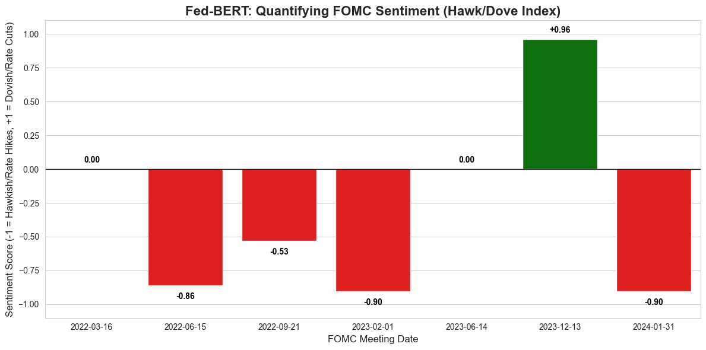

# Fed-BERT: Quantifying Central Bank Sentiment through NLP

### Project Overview
Macro trading strategies rely on understanding the tone of Federal Reserve policy. This project implements an **NLP** pipeline using the **BERT Transformer architecture** (`FinBERT`) to quantify the sentiment of FOMC statements from 2022 to 2024.

By mapping soft-max probability outputs to a custom Hawk-Dove Index, this engine visualizes the shifts in monetary policy "directions" without human bias.

### Key Output
**The Hawk-Dove Sentiment Index (2022–2024)**

*(Figure 1: Visualizing the pivot. Red bars indicate Hawkish language during the hiking cycle; Green bars indicate the Dovish language in late 2023.)*

### Methodology
1.  **Model:** Used `ProsusAI/finbert` which is a pre-trained LLM that is fine-tuned on financial 10-k filings to understand differences in economic syntax (e.g., understanding that "lowering inflation" is positive).
2.  **Tokenization:** Use of BertTokenizer to parse unstructured FOMC text data.
3.  **Scoring Logic:** 
    *   Extracted raw logits from the model's final layer.
    *   Mapped `Negative` labels to **-1 (Hawkish)**.
    *   Mapped `Positive` labels to **+1 (Dovish)**.
    *   Mapped `Neutral` labels to **0**.

### Tech Stack
*   **Python 3.10**
*   **Hugging Face Transformers** (NLP Architecture)
*   **PyTorch** (Tensor computation)
*   **Seaborn/Matplotlib** (Data Visualization)
